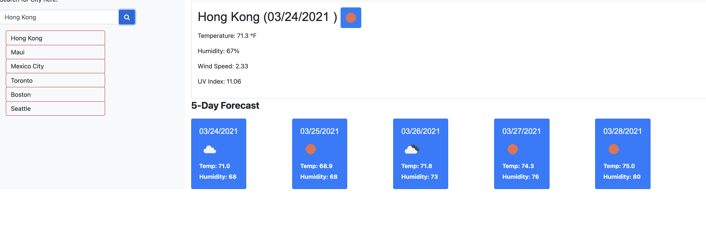
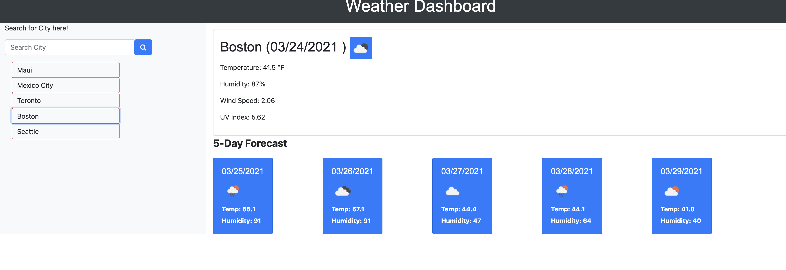
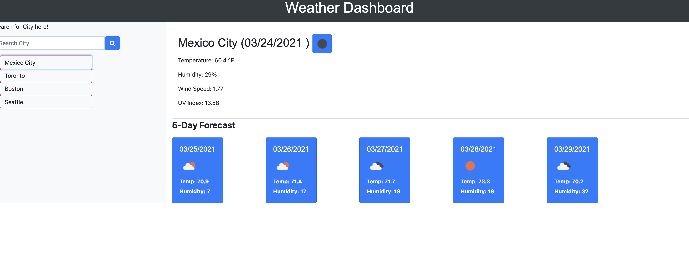

# Weather Dashboard

Tasked to build a weather dashboard that will run in the browser. Allowing a user to see weather when they search a desired City. The data will be retrieved using a third-party API. 

## User Story

```
AS A traveler
I WANT to see the weather outlook for multiple cities
SO THAT I can plan a trip accordingly
```

## Screenshot of Application




## Github Deployment

https://jr-source.github.io/Weather-Dashboard/


